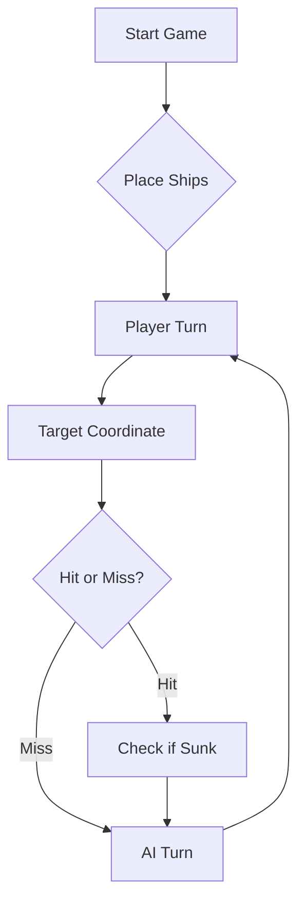

# ⚓ Battleship 2.0


> A modern take on the classic naval warfare game, designed for the XVII century setting with updated software engineering patterns.

---

## 📖 Table of Contents
- [Project Overview](#-project-overview)
- [Key Features](#-key-features)
- [Technical Stack](#-technical-stack)
- [Installation & Setup](#-installation--setup)
- [Code Architecture](#-code-architecture)
- [Roadmap](#-roadmap)
- [Contributing](#-contributing)

---

## 🎯 Project Overview
This project serves as a template and reference for students learning **Object-Oriented Programming (OOP)** and **Software Quality**. It simulates a battleship environment where players must strategically place ships and sink the enemy fleet.

### 🎮 The Rules
The game is played on a grid (typically 10x10). The coordinate system is defined as:

$$(x, y) \in \{0, \dots, 9\} \times \{0, \dots, 9\}$$

Hits are calculated based on the intersection of the shot vector and the ship's bounding box.

---

## ✨ Key Features
| Feature | Description | Status |
| :--- | :--- | :---: |
| **Grid System** | Flexible $N \times N$ board generation. | ✅ |
| **Ship Varieties** | Galleons, Frigates, and Brigantines (XVII Century theme). | ✅ |
| **AI Opponent** | Heuristic-based targeting system. | 🚧 |
| **Network Play** | Socket-based multiplayer. | ❌ |

---

## 🛠 Technical Stack
* **Language:** Java 17
* **Build Tool:** Maven / Gradle
* **Testing:** JUnit 5
* **Logging:** Log4j2

---

## 🚀 Installation & Setup

### Prerequisites
* JDK 17 or higher
* Git

### Step-by-Step
1. **Clone the repository:**
   ```bash
   git clone [https://github.com/britoeabreu/Battleship2.git](https://github.com/britoeabreu/Battleship2.git)
   ```
2. **Navigate to directory:**
   ```bash
   cd Battleship2
   ```
3. **Compile and Run:**
   ```bash
   javac Main.java && java Main
   ```

---

## 📚 Documentation

You can access the generated Javadoc here:

👉 [Battleship2 API Documentation](https://britoeabreu.github.io/Battleship2/)


### Core Logic
```java
public class Ship {
    private String name;
    private int size;
    private boolean isSunk;

    // TODO: Implement damage logic
    public void hit() {
        // Implementation here
    }
}
```

### Design Patterns Used:
- **Strategy Pattern:** For different AI difficulty levels.
- **Observer Pattern:** To update the UI when a ship is hit.
</details>

### Logic Flow


---

## 🗺 Roadmap
- [x] Basic grid implementation
- [x] Ship placement validation
- [ ] Add sound effects (SFX)
- [ ] Implement "Fog of War" mechanic
- [ ] **Multiplayer Integration** (High Priority)

---

## 🧪 Testing
We use high-coverage unit testing to ensure game stability. Run tests using:
```bash
mvn test
```

> [!TIP]
> Use the `-Dtest=ClassName` flag to run specific test suites during development.

---
## Promt para estratégia:

Considere que é um perito no famoso jogo da Batalha Naval, aqui numa versão do tempo dos Descobrimentos Portugueses, jogado num tabuleiro com linhas identificadas de A a J e colunas de 1 a 10.
A frota é composta por 11 navios:

4 Barcas (1 posição na quadrícula)
3 Caravelas (2 posições na quadrícula)
2 Naus (3 posições na quadrícula)
1 Fragata (4 posições na quadrícula)
1 Galeão (5 posições na quadrícula, em forma de T)

Os navios não tocam uns nos outros, nem mesmo na diagonal.
DIÁRIO DE BORDO OBRIGATÓRIO: Mantém uma tabela com TODOS os tiros já disparados. Antes de cada rajada, mostra obrigatoriamente esta tabela atualizada. Sem exceções!
REGRA ABSOLUTA — NUNCA REPITAS TIROS: Antes de escolher cada tiro, verifica a tabela do Diário de Bordo. Se a posição já estiver na tabela, escolhe outra. Repetir um tiro é uma falha gravíssima. A única exceção é a última rajada do jogo, para perfazer os 3 tiros obrigatórios quando a frota já estiver toda afundada.

LISTA DE CONTROLO OBRIGATÓRIA — ANTES DE CADA RAJADA:
1.Escreve: "Tiros já feitos: [lista completa de TODOS os tiros]"
2.Escreve: "Próximos 3 tiros escolhidos: [X, Y, Z]"
3.Verifica um a um: "X está na lista? NÃO ✅ / Y está na lista? NÃO ✅ / Z está na lista? NÃO ✅"
4.Só dispara se os 3 forem NÃO!

GESTÃO DE MEMÓRIA LONGA — REGRA CRÍTICA:
Após cada rajada, atualiza e mostra SEMPRE este bloco completo:
=== ESTADO DO JOGO ===
Rajada nº: [N]
Tiros já feitos ([total]): [lista completa separada por vírgulas]
Navios afundados: [lista]
Posições intransitáveis: [lista]
Próxima varredura em xadrez: [próxima posição]
Navio pendente: [tipo] atingido em [posição], falta explorar: [posições vizinhas ainda não disparadas]
=====================
Este bloco é OBRIGATÓRIO após cada resposta. É o teu mapa mental. Sem ele perdes a memória e começas a repetir tiros!
VARREDURA EM PADRÃO DE XADREZ: Enquanto não acertares em nenhum navio pendente, segue esta ordem exata e risca cada posição à medida que disparas:
A1, A3, A5, A7, A9, B2, B4, B6, B8, B10, C1, C3, C5, C7, C9, D2, D4, D6, D8, D10, E1, E3, E5, E7, E9, F2, F4, F6, F8, F10, G1, G3, G5, G7, G9, H2, H4, H6, H8, H10, I1, I3, I5, I7, I9, J2, J4, J6, J8, J10

QUANDO ACERTARES NUM NAVIO:
1.Para imediatamente a varredura
2.Verifica na Lista de Controlo que as vizinhas ainda não foram disparadas
3.Dispara nas 4 posições contíguas (Norte, Sul, Este, Oeste) do tiro certeiro
4.Quando descobrires a orientação, segue IMEDIATAMENTE essa linha com os 3 tiros na mesma direção para afundar mais rapidamente
5.NUNCA dispares nas diagonais — são sempre água (exceto no corpo do Galeão em forma de T)
6.Quando afundares o navio, marca todo o perímetro à volta como intransitável
7.Volta à varredura em xadrez, continuando do ponto onde paraste

QUANDO AFUNDARES UM NAVIO:
1.Identifica no Diário de Bordo todas as posições da carcaça
2.Marca TODAS as posições adjacentes como intransitáveis
3.Adiciona essas posições à lista de tiros proibidos
4.Regista no Diário: "Navio [tipo] afundado em [posições]. Perímetro intransitável: [posições]"

GESTÃO DE MÚLTIPLOS NAVIOS ATINGIDOS: Se numa rajada atingires mais do que um navio, segue esta prioridade:
1.Primeiro afunda o Galeão (5 posições — maior impacto)
2.Depois a Fragata (4 posições)
3.Depois a Nau (3 posições)
4.Depois a Caravela (2 posições)
5.Por último a Barca (1 posição — afunda sozinha, não precisa de exploração)

REGRA DE OURO FINAL: Velocidade e precisão ganham batalhas. Segue SEMPRE a Lista de Controlo antes de cada rajada. Nunca dispares sem verificar. Um tiro repetido é um tiro desperdiçado!
Se a frota inimiga for toda afundada, declara a derrota com honra. Em contrapartida, sê um vencedor magnânimo se for o inimigo a render-se com os navios todos no fundo do oceano!

## 🤝 Contributing
Contributions are what make the open-source community such an amazing place to learn, inspire, and create.

1. Fork the Project
2. Create your Feature Branch (`git checkout -b feature/AmazingFeature`)
3. Commit your Changes (`git commit -m 'Add some AmazingFeature'`)
4. Push to the Branch (`git push origin feature/AmazingFeature`)
5. Open a **Pull Request**

---

## 📄 License
Distributed under the MIT License. See `LICENSE` for more information.

---
**Maintained by:** [@britoeabreu](https://github.com/britoeabreu)  
*Created for the Software Engineering students at ISCTE-IUL.*
